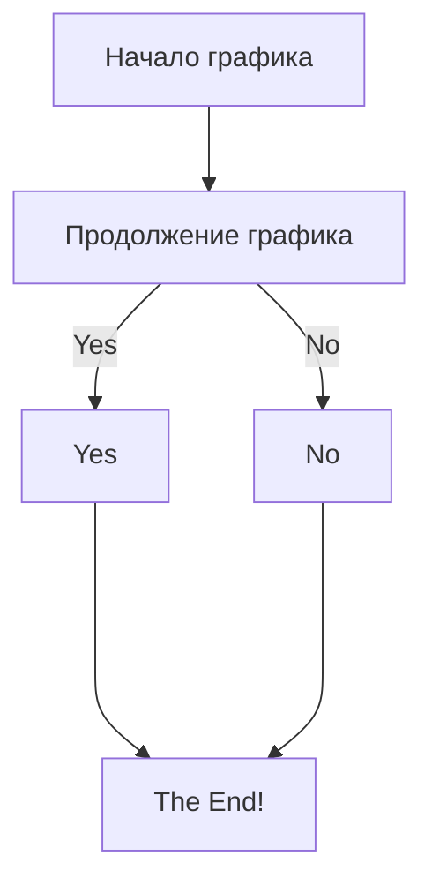

# 3D моделирование "Игровая приставка"
В этом проекте представлен 3D модель сделанный в Blender.

# Для этого потребовалась:
* Производительный ноутбук.
* Программа "Blender".
* Иметь базовые знание по "Blender".

В этом проекте будет фотография в формате "PNG" и файл из "blender".

